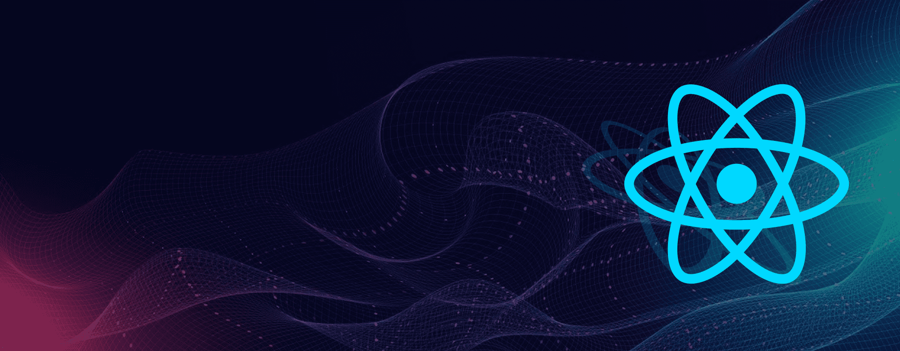

#  Languages and Tools:
<table>
  <tbody width='100%'>
    <tr valign="top">
      </td>
      <td width="20%" align="center">
        <b>JavaScript</b> 
        
      </td>
      <td width="20%" align="center">
        <b>HTML</b> 
        
      </td>
      <td width="20%" align="center">
        <b>CSS</b> 
        
      </td>
      <td width="20%" align="center">
        <b>ES6</b> 
        
      </td>
      <td width="20%" align="center">
        <b>GitHub</b> 
        
      </td>
    <tr valign="top">
      <td width="20%" align="center">
        <b>React</b> 
        
      </td>
      <td width="20%" align="center">
        <b>Babel</b> 
        
      </td>
      <td width="20%" align="center">
        <b>React Native</b> 
        
      </td>
            <td width="20%" align="center">
        <b>Redux</b> 
        
      </td>
       <td width="20%" align="center">
        <b>Bootstrap</b> 
        
      </td>
    </tr>
    <tr valign="top">
    <td width="20%" align="center">
        <b>Expo</b> 
        
      </td>
      <td width="20%" align="center">
        <b>VS code</b> 
        
              <td width="20%" align="center">
        <b>Material UI</b> 
        
      </td>
        <td width="20%" align="center">
        <b>Three.js</b> 
        
      </td>
       <td width="20%" align="center">
        <b>Terminal</b> 
        
      </td>
      
  </tbody>
</table>
